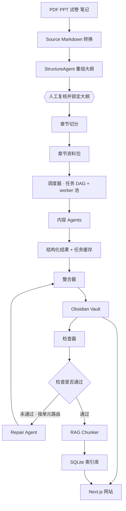
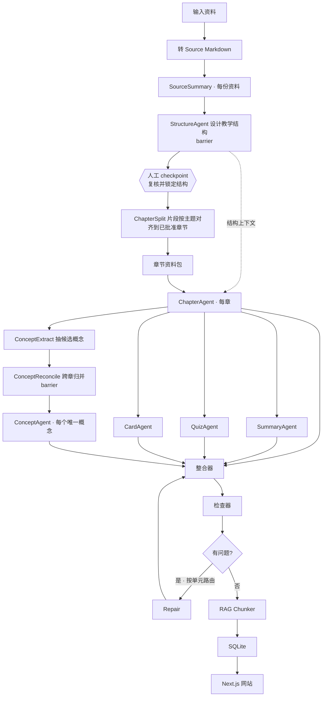
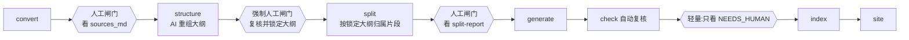
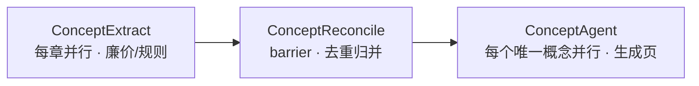
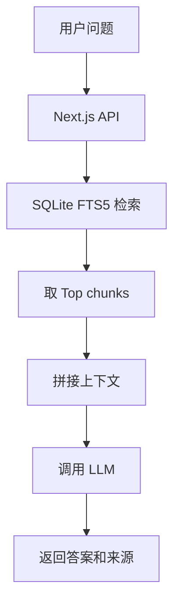

# BookWiki 完整设计稿 v2

> 本版相对 v1 的主要变化:Agent 调度从「固定阶段 + 每章串行 + 单一并发数」重做为
> **任务 DAG + 全局 worker 池调度器**,并补上断点续跑、任务级重试、速率/成本预算、
> 定向修复、概念归并、运行清单六项能力。

---

## 1. 项目简介

BookWiki 是一个面向单本教材或单门课程的学习网站生成系统。

系统接收教材 PDF、课件 PPT、试卷、笔记等资料。系统先把原始资料转换成带来源标记的 Markdown。随后,系统按章节把这些 Markdown
切成章节资料包。多个 AI agent 根据章节资料包生成章节正文、章节总结、Quiz、Cards 和概念页。内容 agent
不写最终文件,只返回结构化内容。整合器负责把这些内容写入 Obsidian 风格的 Markdown。

所有 agent 工作由一个**调度器**统一编排。调度器把整次生成看成一张任务依赖图(DAG),用一个全局 worker
池执行,支持断点续跑、按任务重试、速率与成本控制。

系统最后从生成好的 Obsidian vault 构建 SQLite 检索库。Next.js 网站读取 Markdown 渲染 wiki 页面,并读取 SQLite
提供搜索、Quiz、Cards 和基于本书内容的问答。

这个项目的核心思想是:

> 一本书对应一个 Obsidian vault,一个 SQLite 索引库,一个半静态学习网站。

网站没有登录系统,也没有学习进度。网站的 API key 只通过服务端环境变量读取。

---

## 2. 项目目标

BookWiki 需要完成从「资料」到「学习网站」的完整转换。

| 目标          | 描述                                |
|-------------|-----------------------------------|
| 资料转换        | 把 PDF、PPT、试卷和笔记转成 Markdown        |
| 章节组织        | 按教材或课程结构切分章节资料                    |
| 内容生成        | 生成章节正文、总结、题目、卡片和概念页               |
| 可靠生成        | 调度可断点续跑、可增量重建、可控成本                |
| Obsidian 兼容 | 输出可以被 Obsidian 打开的 Markdown vault |
| 网站展示        | 用 Next.js 把 vault 渲染成学习网站         |
| 搜索问答        | 用 SQLite 支持全文搜索和 RAG 问答           |
| 单书隔离        | 每本书独立生成网站和检索库                     |

项目不做大型学习平台。项目只围绕「单本书生成一个学习站点」。

---

## 3. 总体架构



系统分成七个大模块:

| 模块         | 作用                                  |
|------------|-------------------------------------|
| 资料转换模块     | 把 PDF、PPT、试卷转成 Markdown             |
| 结构设计模块     | 用 AI 重组全书大纲,经人工复核后锁定章节骨架 |
| 章节切分模块     | 按已锁定章节骨架把 source Markdown 切成 chapter source |
| 调度模块       | 构建任务 DAG,管理 worker 池、缓存、重试、预算       |
| Agent 生成模块 | 生成章节、summary、quiz、cards、概念页         |
| 整合与检查模块    | 写入 vault,检查格式与来源,定向修复               |
| 网站与检索模块    | 构建 SQLite,并渲染网站                     |

---

## 4. 目录设计

每本书拥有独立目录。

```text
books/
  ai-intro/
    book.config.json

    input/
      textbook.pdf
      lecture01.pptx
      lecture02.pptx
      exam-2023.pdf

    work/
      sources_md/
        textbook.md
        lecture01.md
        lecture02.md
        exam-2023.md

      structure/
        source-summaries/
          textbook.summary.json
          lecture01.summary.json
        proposed-structure.json       # AI 重组后的建议大纲
        approved-structure.json       # 人工复核、修改并锁定后的大纲
        structure-review.md           # 复核说明与待确认点

      chapter_sources/
        ch01/
          textbook.md
          lecture01.md
          exam-2023.md
        ch02/
          textbook.md
          lecture02.md

      agent_results/
        ch01.chapter.json
        ch01.summary.json
        ch01.quiz.json
        ch01.cards.json
        concepts.reconciled.json
        concept.智能体.json

      .cache/                       # v2: 任务幂等缓存
        ch01:chapter.meta.json
        ch01:quiz.meta.json

      logs/
        chapter-split-report.md
        check-report.md
        check-report.json
        run-manifest.json           # v2: 调度运行清单
        build.log

    vault/
      index.md
      chapters/
        ch01-人工智能绪论.md
        ch02-搜索问题.md
      concepts/
        智能体.md
        状态空间.md
        A星算法.md
      sources/
        textbook.md
        lecture01.md
        exam-2023.md
      assets/

    site/
      .bookwiki/
        bookwiki.sqlite
      .env.local
```

各目录职责:

| 目录                     | 说明                |
|------------------------|-------------------|
| `input`                | 原始输入资料            |
| `work/sources_md`      | 每份资料转换后的 Markdown |
| `work/structure`       | AI 重组大纲、人工复核记录和锁定后的章节结构 |
| `work/chapter_sources` | 按章节切好的资料包         |
| `work/agent_results`   | agent 返回的结构化内容    |
| `work/.cache`          | 任务级缓存,支持断点续跑      |
| `work/logs`            | 检查报告、运行清单和日志      |
| `vault`                | 最终 Obsidian 知识库   |
| `site`                 | 生成后的网站和 SQLite 索引 |

---

## 5. 配置文件

每本书有一个 `book.config.json`。

```json
{
  "id": "ai-intro",
  "title": "人工智能导论",
  "language": "zh-CN",
  "siteTitle": "人工智能导论 Wiki",
  "sources": [
    {
      "file": "textbook.pdf",
      "role": "primary"
    },
    {
      "file": "textbook-v4.pdf",
      "role": "secondary"
    },
    {
      "file": "lecture01.pptx",
      "role": "supplementary"
    },
    {
      "file": "exam-2023.pdf",
      "role": "exam"
    }
  ],
  "structure": {
    "strategy": "pedagogical",
    "review": "required"
  },
  "generation": {
    "maxConcurrency": 8,
    "rateLimit": {
      "rpm": 60,
      "tpm": 200000
    },
    "budget": {
      "maxTokens": 2000000,
      "maxCostUsd": 10
    },
    "retry": {
      "transient": 3,
      "schema": 2,
      "backoffBaseMs": 500
    },
    "maxRepairRounds": 2,
    "useOutlineContext": true,
    "enrichFromModelKnowledge": false,
    "quizPerChapter": 8,
    "cardsPerChapter": 12,
    "models": {
      "sourceSummary": "cheap-model",
      "structure": "strong-model",
      "chapter": "strong-model",
      "summary": "cheap-model",
      "quiz": "strong-model",
      "card": "cheap-model",
      "concept": "strong-model",
      "review": "strong-model"
    }
  },
  "features": {
    "chat": true,
    "search": true,
    "quiz": true,
    "cards": true,
    "ankiExport": false
  }
}
```

`sources` 给每份资料标角色,告诉对齐器谁是骨架素材、谁是补充:

| role            | 含义                           |
|-----------------|------------------------------|
| `primary`       | 主要教材,内容覆盖最全;冲突时以它为主          |
| `secondary`     | 另一版本/另一本教材,提供"另一种讲法",冲突时并列展示 |
| `supplementary` | 课件、笔记等补充材料                   |
| `exam`          | 试卷,按主题映射到章节用于出题与易错点          |

注意:`role` 只影响**冲突时的取舍和呈现**,不决定章节骨架——骨架由 StructureAgent 综合所有来源设计。

`structure` 控制结构设计与复核:

| 字段         | 取值                          | 说明                              |
|------------|-----------------------------|---------------------------------|
| `strategy` | `pedagogical`(默认)/ `source` | 重排成教学结构,或忠实照搬主教材目录              |
| `review`   | `required`(默认)/ `skip`      | 是否在结构落地前强制人工复核 checkpoint(§7.3) |

`generation` 块字段:

| 字段                         | 作用                                         |
|----------------------------|--------------------------------------------|
| `maxConcurrency`           | 逻辑并发:同时在飞的任务数                              |
| `rateLimit`                | API 限速:每分钟请求数与 token 数(令牌桶,全局共享)           |
| `budget`                   | 整次 build 的硬上限,超出则停止派发新任务                   |
| `retry`                    | 任务级重试:瞬时错误与 schema 错误的次数、退避基数              |
| `maxRepairRounds`          | 单元级修复轮数上限(注意:按受影响单元计,不是全局)                 |
| `useOutlineContext`        | 章节生成是否依赖全书结构(一致性 vs 延迟的开关)                 |
| `enrichFromModelKnowledge` | 是否允许用模型自身知识补充原书缺失内容,默认关;开启时补充段落必须标注"非本书内容" |
| `models`                   | 按 agent 选模型,便宜模型干轻活,强模型干重活                 |

`models` 是最大的成本杠杆:Summary、Card 用便宜模型,Structure、Chapter、Quiz、Concept 用强模型,通常能在几乎不掉质量的前提下显著降本。

---

## 6. 数据阶段

### 6.1 原始资料

输入资料放在 `input` 目录。

| 类型          | 支持情况   |
|-------------|--------|
| PDF 教材      | 支持文字版  |
| PPTX 课件     | 支持文本提取 |
| Markdown 笔记 | 支持     |
| TXT 文本      | 支持     |
| 扫描版 PDF     | 后续增强   |
| 视频          | 后续增强   |

### 6.2 Source Markdown

每份资料先转成 Markdown,并写入 `source_ref`。

```markdown
# textbook

<!-- source_ref: textbook-p12 -->

## Page 12

智能体通过感知器感知环境,并通过执行器采取行动。

<!-- source_ref: textbook-p13 -->

## Page 13

环境可以被划分为完全可观察环境和部分可观察环境。
```

```markdown
# lecture01

<!-- source_ref: lecture01-slide08 -->

## Slide 8: Agent

Agent = Sensors + Actuators + Environment
```

`source_ref` 是后面内容引用和问答来源的基础。所有 agent 在生成内容时,**只能引用输入资料里真实出现过的 `source_ref`**(见
§11 来源白名单)。

### 6.3 Chapter Source

章节资料包不是"把整份文件塞进某一章",而是**把每份资料切成带 `source_ref` 的片段,再按主题对齐到已批准结构的章节上**
。对齐是内容驱动的分类,不是按文件顺序切:一张讲 A\* 的幻灯片就进"启发式搜索"那一章,无论它来自第几次课、哪本教材。

因此一个章节目录里通常并列着来自多个来源的片段:

```text
work/chapter_sources/
  ch03/
    textbook.md         # 主教材 p80–95(本章主干)
    textbook-v4.md      # 另一版本对应段落(另一种讲法)
    lecture03.md        # 第3次课 slide 1–12
    lecture04.md        # 第4次课 slide 1–4(讲到本章主题的溢出部分)
    exam-2023.md        # 试卷里考本章的第 5、6、9 题
    _alignment.json     # 片段来源、置信度、所属章节,供追溯与 split-report
```

对齐遵循几条规则:

- **多对一 / 一对多**:一章可汇集多个来源的片段;一个片段(如跨主题的复习页)也可同时归入多章。
- **边角料显式处理**:配不上任何章的片段进"附录/补充"桶,或自成体系时新开一章;某章缺某模态(老师跳过的章)就让它片段少一些,在
  split-report 标出。
- **冲突不隐藏**:多来源对同一主题讲法不同时,以 `primary` 为主、其余补充;真正矛盾处两边并列、各带 `source_ref`。
- **置信度 + 报告**:每条归属带置信度,汇总进 `chapter-split-report.md`(来源 × 章节对齐矩阵 + 未归属清单),正是 §7.3 结构
  checkpoint 上人工要审的对象。

内容 agent 只读取本章目录中的片段。

### 6.4 Agent Results

Agent 生成结果统一放到 `work/agent_results`,先经过 schema 校验,再交给整合器。

```text
ch03.chapter.json
ch03.summary.json
ch03.quiz.json
ch03.cards.json
concepts.reconciled.json     # 概念归并后的全局清单
concept.启发函数.json
```

每个结果旁边还有一份缓存元数据 `work/.cache/{task_id}.meta.json`,用于断点续跑(见 §10.4)。

### 6.5 Obsidian Vault

整合器生成最终 Markdown。

```text
vault/
  index.md
  chapters/
  concepts/
  sources/
  assets/
```

章节、summary、quiz、cards 都写在同一个章节 Markdown 中。

### 6.6 SQLite

最终 vault 通过 RAG chunker 和 indexer 生成 SQLite,只用于网站搜索、Quiz、Cards 和问答。

```text
site/.bookwiki/bookwiki.sqlite
```

---

## 7. 生成流程

### 7.1 任务依赖图

生成阶段不是线性流水线,而是一张 DAG。两个关键点:**(1) 章节结构由 StructureAgent 设计、经人工 checkpoint 批准后才落地;(2)
ChapterAgent 跑完后,SummaryAgent / QuizAgent / CardAgent / ConceptExtract 之间互不依赖,全部并行执行。**



流程中有一道**硬性人工 checkpoint** 和两个 barrier:

- **结构 checkpoint**:StructureAgent 产出建议结构 + 片段映射草案后,人在此审阅、修改、锁定(`structure.review: required`
  时强制,§7.3)。锁定前不进入任何章节生成,不烧后续 LLM。
- **StructureAgent**(barrier):等所有 `SourceSummary` 完成,综合全部来源摘要设计章节骨架与顺序。用摘要而非全文做对齐,既省又准。
- **ConceptReconcile**(barrier):等所有 `ConceptExtract` 完成,做跨章概念去重(见 §12)。

`structure.strategy` 决定 StructureAgent 怎么排骨架:`pedagogical`(默认,按"怎样学最顺"重排)或 `source`(忠实照搬 `primary`
教材目录)。无论哪种,都要过同一道 checkpoint。

`useOutlineContext` 决定 ChapterAgent 是否把已批准结构作为上下文:

| 取值    | 含义                                 | 收益            | 代价                |
|-------|------------------------------------|---------------|-------------------|
| true  | Chapter 依赖已批准结构                    | 跨章术语统一、概念命名一致 | 章节生成前有一个短 barrier |
| false | Chapter 不依赖结构上下文,结构仅用于 index 与交叉链接 | 最大并行度         | 跨章一致性弱一些          |

默认 `true`。

### 7.2 详细步骤

| 步骤   | 输入                              | 输出                     | 负责模块     |
|------|---------------------------------|------------------------|----------|
| 资料转换 | PDF、PPT、试卷                      | `sources_md/*.md`      | 资料转换     |
| 资料摘要 | source Markdown                 | source summary         | Agent 生成 |
| 大纲重组 | source summaries                | `proposed-structure.json` | StructureAgent |
| 人工复核 | proposed structure + 片段映射草案    | `approved-structure.json` | 人工 checkpoint |
| 章节切分 | source Markdown + approved structure | `chapter_sources/chxx` | 章节切分     |
| 章节生成 | chapter source(+ approved structure) | chapter result         | Agent 生成 |
| 总结生成 | chapter result                  | summary result         | Agent 生成 |
| 题目生成 | chapter source + chapter result | quiz result            | Agent 生成 |
| 卡片生成 | chapter source + chapter result | cards result           | Agent 生成 |
| 概念抽取 | chapter result                  | concept candidates     | Agent 生成 |
| 概念归并 | 所有 concept candidates           | concept worklist       | 调度/归并    |
| 概念生成 | concept worklist + 引用上下文        | concept result         | Agent 生成 |
| 内容整合 | agent results                   | vault Markdown         | 整合模块     |
| 内容检查 | vault                           | check report           | 检查模块     |
| 定向修复 | check report(按 owner 分组)        | repair result          | Repair   |
| 索引构建 | vault                           | SQLite                 | 网站与检索    |
| 网站运行 | vault + SQLite                  | 学习网站                   | 网站模块     |

### 7.3 分阶段执行与复核闸门

§7.1 的 DAG 描述的是 **structure / split / generate 这几段内部** 的依赖关系。在更外层,整条流水线按"阶段"组织:
**convert → structure → split → generate → check → index**。这里有一个明确的设计选择:**阶段之间通过磁盘文件通信,不靠内存对象传递。**

这样做的直接好处是,同一套代码既能逐段跑、也能一键跑完,不必二选一:

- 阶段产物全部落盘:`sources_md/`、`structure/approved-structure.json`、`chapter_sources/`、`agent_results/`、`vault/`、`bookwiki.sqlite`。
- 每个阶段是独立 CLI 命令,可以单独运行、单独看输出(见 §17)。
- `build` 把这些命令串起来,配合任务缓存(§10.4),中途停了 `--resume` 接着跑。
- 这也是 5 人并行开发的前提:每人拿固定的中间文件,单独测自己那一段。

**复核闸门只设在"便宜到改、贵到晚发现"的阶段,不是每个阶段都卡。** 经验上人工只值得卡前三道:

| 阶段边界            | 是否设人工闸门   | 原因                                                       |
|-----------------|-----------|----------------------------------------------------------|
| convert 之后      | **建议设**   | PDF/PPT 提取最脏(断页、页眉页脚、source_ref 错乱),错了污染全部下游;改起来便宜,晚发现极贵 |
| structure 之后    | **强制设**   | 最开始的大纲必须先由 AI 综合所有资料重组,再由人复核、修改并锁定;锁定前不进入章节切分和后续 LLM |
| split 之后        | **建议设**   | 片段归属容易错;ch03 串了内容,ch03 五个 agent 全白跑;纠正只是改文件归属     |
| generate 之后     | 不设(交给检查器) | LLM 最贵、产出量最大的一段,人逐条审 N 章 × 5 agent 不现实;这一段的"复核"由检查器自动完成  |
| check 之后        | 轻量        | 只看 `check-report` 里被标 `NEEDS_HUMAN` 的少数几条,不是全量复核         |
| index / site 之后 | 不设        | 机械步骤                                                     |

换句话说,人工闸门本质是一道**省钱闸门**:确认源头和骨架(convert / structure / split)干净了,再放 LLM 下去烧 token。最贵的 generate
反而交给自动检查器(§13)兜底,而不是人。

实现上:`build` 默认一键贯通,但 `structure.review: required` 时必须在 `structure` 后暂停;通过 `--pause-after` 可在其他指定阶段后暂停,
等人工确认 `structure/approved-structure.json`、`chapter-split-report.md` 等中间产物后再继续(见 §17)。团队约定第一次跑某本书时先手动走
`convert`、`structure`、`split` 三步,确认无误后再 `generate` 往后一键。



---

## 8. 章节 Markdown 规范

章节文件是最重要的内容单元。summary、quiz、cards 都写在章节文件里。

~~~markdown
---
title: 启发式搜索
type: chapter
chapter_id: ch03
order: 3
concepts:
  - 启发函数
  - 贪心最佳优先搜索
  - A星算法
source_refs:
  - textbook-p80
  - lecture03-slide10
---

# 启发式搜索

<!-- BOOKWIKI:BODY:START -->

## 本章导读

本章介绍启发式搜索的基本思想。启发式搜索利用额外信息估计搜索方向。

## 主要内容

启发函数用于估计当前状态到目标状态的代价。A星算法使用 f(n)=g(n)+h(n) 评价节点。

<!-- BOOKWIKI:BODY:END -->

<!-- BOOKWIKI:SUMMARY:START -->

## 本章总结

本章的核心是启发函数和 A星算法。启发函数影响搜索效率和最优性。

## 易错点

A星算法的最优性依赖启发函数的性质。不是任意启发函数都能保证最优解。

<!-- BOOKWIKI:SUMMARY:END -->

<!-- BOOKWIKI:QUIZ:START -->

## 本章 Quiz

```quiz
id: ch03-q001
type: single
difficulty: easy
concepts:
  - 启发函数
question: 启发函数的作用是什么?
options:
  A: 估计当前状态到目标状态的代价
  B: 保存所有搜索节点
  C: 删除目标测试
  D: 替代搜索算法
answer: A
explanation: 启发函数用于估计当前状态到目标状态的代价。
source_refs:
  - textbook-p83
```

<!-- BOOKWIKI:QUIZ:END -->

<!-- BOOKWIKI:CARDS:START -->

## 本章 Cards

```card
id: ch03-card001
front: 启发函数是什么?
back: 启发函数用于估计当前状态到目标状态的代价。
tags:
  - 启发式搜索
source_refs:
  - textbook-p83
```

<!-- BOOKWIKI:CARDS:END -->
~~~

区域标记用于整合器写入内容。整合器可以只替换某个区域,避免覆盖整章文件。章节文件还可保留一个人工备注区,整合器默认不修改:

```markdown
<!-- BOOKWIKI:NOTES:START -->

## 人工备注

<!-- BOOKWIKI:NOTES:END -->
```

---

## 9. Agent 设计

### 9.1 Agent 原则

Agent 不写最终 Markdown,只返回结构化内容,整合器负责写入文件。每个 agent 的输入都有明确范围。例如生成第 3 章内容时,agent
只读取 `work/chapter_sources/ch03/`。

所有 agent 实现统一的基类接口,以便被调度器编排:

```python
class Agent(Protocol):
    type: TaskType

    def build_input(self, task: Task) -> AgentInput: ...

    async def run(self, inp: AgentInput, model: str) -> dict: ...  # 返回符合 schema 的 dict

    def validate(self, out: dict) -> list[SchemaError]: ...  # schema 校验
```

调度器只与这个接口打交道,不关心 agent 内部如何 prompt。

### 9.2 Agent 列表

| Agent              | 任务     | 输入                          | 输出                 |
|--------------------|--------|-----------------------------|--------------------|
| SourceSummaryAgent | 生成资料摘要 | source Markdown             | 摘要 JSON            |
| StructureAgent     | AI 重组全书大纲 | source summaries            | proposed structure JSON |
| ChapterSplitAgent  | 按锁定大纲归属片段 | source Markdown、approved structure | chapter map        |
| ChapterAgent       | 生成章节正文 | chapter source(+ approved structure) | chapter JSON       |
| SummaryAgent       | 生成本章总结 | chapter source、chapter JSON | summary JSON       |
| QuizAgent          | 生成题目   | chapter source、chapter JSON | quiz JSON          |
| CardAgent          | 生成卡片   | chapter source、chapter JSON | cards JSON         |
| ConceptExtract     | 抽取候选概念 | chapter JSON                | concept candidates |
| ConceptReconcile   | 跨章去重归并 | 所有 concept candidates       | concept worklist   |
| ConceptAgent       | 生成概念页  | worklist 项 + 引用上下文          | concept JSON       |
| ReviewAgent        | 按单元修复  | 该单元的原输入 + 具体 issue          | repair JSON        |

`ConceptExtract` 多数情况下不需要额外 LLM 调用——`ChapterResult` 已带 `concepts` 字段,可直接复用。

### 9.3 任务模型

调度器把每一次 agent 工作抽象成一个 `Task`:

```python
@dataclass
class Task:
    id: str  # "ch03:chapter" / "ch03:quiz" / "concept:启发函数"
    type: TaskType  # SOURCE_SUMMARY|STRUCTURE|CHAPTER|SUMMARY|QUIZ|CARD
    # |CONCEPT_EXTRACT|CONCEPT_RECONCILE|CONCEPT|REVIEW
    deps: list[str]  # 依赖的上游 task id
    inputs: list[str]  # 解析后的输入文件/上游产物路径
    input_hash: str  # hash(inputs + prompt_version + model),缓存与失效依据
    cost_weight: int  # 粗略 token 成本,用于预算与优先级排序
    priority: int  # 关键路径优先
    owner: TaskType  # 用于检查器把 issue 路由回正确的修复任务
```

调度器只认 `Task` 与其依赖,不再有"阶段"的概念。

---

## 10. 调度器设计(v2 核心)

调度器是这版改动最大的部分。它把整次生成当成一张 DAG,用一个全局 worker 池执行,并负责缓存、重试、限速和预算。

### 10.1 全局 worker 池

```text
ready_queue = 所有 deps 已全部 DONE 的任务
workers     = maxConcurrency 个协程,循环从 ready_queue 取任务执行
完成一个任务 -> 从下游依赖里划掉它 -> 新就绪的任务进 ready_queue
```

调度顺序按**关键路径优先**(拓扑深度 / `cost_weight`):`Chapter > Concept > Summary/Quiz/Card`。这样 ch01 的 Quiz 可以在
ch05 的 Chapter 还在跑时插队执行,**worker 不会因为等待"阶段"结束而空转**。

```python
async def run(dag: Dag, cfg: GenConfig):
    sem = asyncio.Semaphore(cfg.maxConcurrency)

    async def worker(task: Task):
        async with sem:
            if cache.hit(task):  # 11.4 断点续跑
                dag.mark_done(task);
                return
            await limiter.acquire(task.cost_weight)  # 11.3 限速/预算
            result = await run_with_retry(task, cfg)  # 11.5 任务级重试
            cache.put(task, result)
            dag.mark_done(task)  # 解锁下游

    while not dag.all_done():
        ready = dag.pop_ready(by="priority")
        await asyncio.gather(*(worker(t) for t in ready))
```

### 10.2 两级并发

把 v1 揉成一个数字的 `maxConcurrency` 拆成三层,各管各的:

| 层    | 控制什么                      | 配置                                 |
|------|---------------------------|------------------------------------|
| 逻辑并发 | 同时在飞的任务数                  | `maxConcurrency`                   |
| 速率限制 | API 的 RPM / TPM(令牌桶,全局共享) | `rateLimit.rpm` / `.tpm`           |
| 成本预算 | 整次 build 的硬上限             | `budget.maxTokens` / `.maxCostUsd` |

三者解耦后,"我有 20 个就绪任务"和"API 每秒只允许 N 个请求"不再打架,也能给演示设花费上限,跑超了自动停止派发。

### 10.3 速率与预算

- **令牌桶限速器**:所有 worker 在每次 LLM 调用前向限速器申请配额,尊重返回的 `Retry-After`。
- **预算守卫**:维护累计 token / 成本,逼近上限时停止派发新任务,已在飞的任务正常完成,并在 run-manifest 标记
  `BUDGET_STOPPED`。

### 10.4 幂等任务缓存:断点续跑 + 增量重建

每个任务产物落在 `work/agent_results/{id}.json`,旁边写一份元数据:

```json
{
  "input_hash": "9f2c…",
  "model": "strong-model",
  "prompt_version": "v3",
  "status": "DONE",
  "timestamp": "2026-05-20T10:02:11Z",
  "tokens": 5900
}
```

运行时算出当前 `input_hash`,若缓存中存在相同 hash 且 `status=DONE`,直接跳过(cache hit)。带来两个能力:

- **断点续跑**:跑到 ch08 崩溃,重跑自动跳过 ch01–07,只补 ch08 起。
- **增量重建**:只改了 ch03 的 source,`input_hash` 变化沿 DAG 向下级联失效——ch03 的 Chapter/Summary/Quiz/Card 以及引用了
  ch03 的概念会自动重算,其余章节命中缓存不动。

`input_hash` 把 **prompt_version 与 model 一并算入**,因此改 prompt 或换模型也能正确触发重算。

### 10.5 任务级重试

失败分三类,前两类在任务级解决,**不惊动 vault 级修复**:

| 类型        | 例子                | 处理                                                |
|-----------|-------------------|---------------------------------------------------|
| 瞬时错误      | 超时、429、5xx        | 指数退避 + 抖动重试,尊重 `Retry-After`,上限 `retry.transient` |
| schema 错误 | 返回非合法 JSON / 缺字段  | 把校验错误拼回 prompt 重提,上限 `retry.schema`               |
| 内容质量      | JSON 合法但检查器判定缺来源等 | 交给 §13 的定向修复处理,不在此重试                              |

前两类是 v1 完全缺失的兜底,实跑中绝大多数失败属于这两类。

### 10.6 可观测性:运行清单与 dry-run

调度器输出 `work/logs/run-manifest.json`:

```json
{
  "run_id": "2026-05-20T10:00Z-ab12",
  "config": {
    "maxConcurrency": 8
  },
  "tasks": [
    {
      "id": "ch03:chapter",
      "status": "DONE",
      "attempts": 1,
      "duration_ms": 8200,
      "tokens_in": 4100,
      "tokens_out": 1800,
      "cache": "miss"
    },
    {
      "id": "ch03:quiz",
      "status": "DONE",
      "attempts": 2,
      "cache": "miss"
    }
  ],
  "totals": {
    "tasks": 84,
    "cache_hits": 30,
    "tokens": 540000,
    "cost_usd": 1.62,
    "wall_clock_ms": 95000
  }
}
```

`bookwiki generate --dry-run` 只打印 DAG 与预估成本/token,不真正调用 LLM,可在演示前估算"这本书大概几块钱、几分钟"。

---

## 11. 整合器设计

整合器负责把 agent 的结构化结果写入 Markdown。它不调用大模型,只做模板渲染和区域替换。

| 工作              | 说明                                    |
|-----------------|---------------------------------------|
| 合并 frontmatter  | title、chapter_id、concepts、source_refs |
| 写入 BODY/SUMMARY | 章节正文、总结、易错点                           |
| 写入 QUIZ/CARDS   | 把 quiz/card JSON 渲染成代码块               |
| **来源校验(前置)**    | 写入时即校验 source_refs 是否真实存在,fail fast   |
| 保留人工备注          | 不覆盖 `BOOKWIKI:NOTES` 区域               |
| 记录日志            | 保存本次写入记录                              |

**来源白名单**:整合器在调度阶段把每章可用的 `source_ref` 集合传给对应 agent 的 prompt,agent
只能从白名单里引用。再配合整合器写入时的校验,能把"缺来源/错来源"问题在进入检查器之前就消化掉大部分。

输入输出示例:

```text
输入: ch03.chapter.json  ch03.summary.json  ch03.quiz.json  ch03.cards.json
输出: vault/chapters/ch03-启发式搜索.md
```

---

## 12. 概念归并(v2 新增)

v1 的 ConceptAgent "按概念并行"
,但概念是各章各自发现的,同一个「智能体」可能在多章出现——谁负责生成?会重复生成甚至并发写同一个文件。把概念处理拆成三步,消除这个竞争:



1. **ConceptExtract(ch)**(每章,并行,很便宜):从 ChapterResult 抽候选概念 + 别名 + 引用它的章节 + 最佳来源上下文。多数情况下直接复用
   `ChapterResult.concepts`,无需额外 LLM 调用。
2. **ConceptReconcile**(barrier,规则为主 + 一次 LLM 做模糊合并):按归一化名 + 别名匹配去重(解决「智能体」/「Agent」/「agent」)
   ,合并各章引用,定下规范标题,选出最丰富的来源上下文,产出 `concepts.reconciled.json` 概念清单。
3. **ConceptAgent(c)**(每个唯一概念,并行):只生成一次,上下文聚合自所有引用它的章节。

结果:一个概念一个页面、反向链接一致、不重复做功。这一步同时解决了 §13 里 `[[概念]]` 双链检查的时序问题——概念清单先定,章节里的双链才有目标。

---

## 13. 检查器与定向修复

### 13.1 检查项目

检查器保证 vault 能被网站解析。

| 检查项         | 说明                                         |
|-------------|--------------------------------------------|
| frontmatter | 每个文件必须有 title 和 type                       |
| 区域标记        | 章节页必须有 BODY、SUMMARY、QUIZ、CARDS             |
| Quiz 格式     | 每道题必须有 id、type、question、answer、explanation |
| Card 格式     | 每张卡必须有 id、front、back                       |
| source_refs | 所有来源必须能找到                                  |
| 双链          | `[[概念]]` 必须存在页面                            |
| 章节编号        | chapter_id 不能重复                            |
| 空内容         | 章节正文不能为空                                   |
| 题目答案        | 选择题答案必须在 options 中                         |
| SQLite 解析   | 文件必须能被 indexer 解析                          |

### 13.2 检查报告

```text
work/logs/check-report.md
work/logs/check-report.json
```

每条 issue 必须带 `owner_task_id`,以便路由回正确的修复任务:

```json
{
  "issues": [
    {
      "file": "vault/chapters/ch03-启发式搜索.md",
      "section": "QUIZ",
      "issue_type": "missing_source_refs",
      "owner_task_id": "ch03:quiz",
      "message": "ch03-q004 缺少 source_refs",
      "severity": "medium"
    }
  ]
}
```

### 13.3 定向修复

v1 是"整份报告 → 一个 ReviewAgent → 重整合全部"。v2 改成**按受影响单元路由**:

1. 按 `owner_task_id` 把 issue 分组。
2. 每个受影响单元起一个 `Repair(ch03:quiz)` 任务,只重跑对应 agent,输入是原始输入 + 这条具体 issue。
3. 只重整合受影响区域,其余章节不动。
4. `maxRepairRounds` **按单元计数**,不是全局。
5. 某单元超过轮数仍失败 → 标 `NEEDS_HUMAN`,**继续 build 其余部分**,不阻塞整本书。

修复任务同样进调度器的 DAG,享受同一套并发、限速、缓存能力。

---

## 14. SQLite 设计

SQLite 是每本书的只读索引库,位于 `site/.bookwiki/bookwiki.sqlite`。

```sql
CREATE TABLE pages
(
    id               TEXT PRIMARY KEY,
    slug             TEXT NOT NULL UNIQUE,
    path             TEXT NOT NULL,
    title            TEXT NOT NULL,
    type             TEXT NOT NULL,
    chapter_id       TEXT,
    order_index      INTEGER,
    frontmatter_json TEXT NOT NULL,
    content_hash     TEXT NOT NULL -- 用于增量索引:hash 未变则跳过重新 chunk
);

CREATE TABLE chunks
(
    id               TEXT PRIMARY KEY,
    page_id          TEXT    NOT NULL,
    chapter_id       TEXT,
    section_id       TEXT,
    chunk_index      INTEGER NOT NULL,
    heading_path     TEXT,
    text             TEXT    NOT NULL,
    source_refs_json TEXT    NOT NULL,
    token_count      INTEGER,
    FOREIGN KEY (page_id) REFERENCES pages (id)
);

CREATE
VIRTUAL TABLE fts_chunks USING fts5(
  text, title, heading_path,
  content='chunks', content_rowid='rowid'
);

CREATE TABLE quiz_items
(
    id               TEXT PRIMARY KEY,
    chapter_id       TEXT NOT NULL,
    page_id          TEXT NOT NULL,
    type             TEXT NOT NULL,
    difficulty       TEXT,
    concepts_json    TEXT NOT NULL,
    question         TEXT NOT NULL,
    options_json     TEXT,
    answer           TEXT NOT NULL,
    explanation      TEXT,
    source_refs_json TEXT NOT NULL
);

CREATE TABLE card_items
(
    id               TEXT PRIMARY KEY,
    chapter_id       TEXT NOT NULL,
    page_id          TEXT NOT NULL,
    front            TEXT NOT NULL,
    back             TEXT NOT NULL,
    tags_json        TEXT NOT NULL,
    source_refs_json TEXT NOT NULL
);

CREATE TABLE source_refs
(
    id        TEXT PRIMARY KEY,
    source_id TEXT NOT NULL,
    label     TEXT NOT NULL,
    page      INTEGER,
    slide     INTEGER,
    path      TEXT
);
```

第一版用 FTS5 做搜索和 RAG 候选召回,向量检索后续加入。**增量索引**:indexer 比对 `content_hash`,页面未变则跳过重新 chunk,与
§10.4 的任务缓存呼应。

---

## 15. RAG 设计

RAG 只在网站运行阶段使用,不直接使用原始 PDF,而是用最终 vault 生成的 chunk。



检索范围:

| 范围   | 检索条件            |
|------|-----------------|
| 全书提问 | 不限制 chapter_id  |
| 本章提问 | 限制当前 chapter_id |

回答规则:只根据检索到的 chunks 回答;资料没有答案时说明没有找到;回答必须显示来源;网站不保存对话历史;API key 只在服务端环境变量中读取。

---

## 16. 网站设计

网站使用 Next.js。

| 页面       | 路由                      | 数据来源              |
|----------|-------------------------|-------------------|
| 首页       | `/`                     | Markdown 和 SQLite |
| 章节页      | `/wiki/chapters/[slug]` | Markdown          |
| 概念页      | `/wiki/concepts/[slug]` | Markdown          |
| 搜索页      | `/search`               | SQLite            |
| Quiz 区域  | 章节页内                    | SQLite quiz_items |
| Cards 区域 | 章节页内                    | SQLite card_items |
| 问答 API   | `/api/chat`             | SQLite 和 LLM      |

组件:`MarkdownPage`、`WikiLink`(`[[概念]]` 转站内链接)、`QuizBlock`、`CardBlock`、`SourceRef`、`SearchBox`、`ChatBox`、
`ChapterNav`。

API key 安全:

```text
OPENAI_API_KEY=xxxxx
BOOKWIKI_SQLITE_PATH=.bookwiki/bookwiki.sqlite
```

前端不能使用 `NEXT_PUBLIC_OPENAI_API_KEY`,所有模型调用必须发生在服务端 API。

---

## 17. 命令设计

### 17.1 分阶段命令

每个阶段是一个独立子命令,产物落盘,可单独运行、单独检查输出:

```bash
bookwiki init ai-intro "人工智能导论"
bookwiki convert        books/ai-intro     # input/        -> work/sources_md/
bookwiki structure      books/ai-intro     # sources_md/   -> work/structure/proposed-structure.json
bookwiki approve-structure books/ai-intro  # 人工复核/修改/锁定 -> work/structure/approved-structure.json
bookwiki split-chapters books/ai-intro     # sources_md/ + approved structure -> work/chapter_sources/
bookwiki generate       books/ai-intro     # chapter_sources/ -> work/agent_results/ + vault/
bookwiki check          books/ai-intro     # vault/        -> work/logs/check-report.*
bookwiki index          books/ai-intro     # vault/        -> site/.bookwiki/bookwiki.sqlite
bookwiki site           books/ai-intro     # 启动 Next.js
```

因为阶段之间只靠磁盘文件通信(§7.3),所以可以在任意阶段停下来人工复核中间产物,确认无误再跑下一段。

### 17.2 一键命令与人工闸门

总命令按顺序运行 convert → structure → split-chapters → generate → check → index:

```bash
bookwiki build books/ai-intro
```

`build` 默认一键贯通,但 `structure.review: required` 时会在 AI 重组大纲后强制暂停,等待人工复核并锁定。若还要在其他便宜且关键的阶段后停下人工复核,用 `--pause-after`:

```bash
# 第一次跑某本书:先到 structure 为止,人工复核 AI 重组大纲
bookwiki build books/ai-intro --pause-after convert,structure

# 人工修改并锁定 approved-structure.json 后,继续切分并可在 split 后再检查片段归属
bookwiki build books/ai-intro --resume --pause-after split

# 确认无误后,从 generate 往后一键跑完(命中缓存,convert/split 不重算)
bookwiki build books/ai-intro --resume
```

推荐工作流:**第一次跑先卡 `convert`、`structure`、`split` 三道闸门**。其中 `structure` 是硬闸门:AI 先把最开始的大纲重组成人更适合学习的章节骨架,人复核、修改并锁定后,才允许进入章节切分和后续生成。后续迭代直接 `build --resume`
。generate 这一段不设人工闸门,由检查器自动复核(§7.3、§13)。

### 17.3 命令开关

| 开关                | 作用                        |
|-------------------|---------------------------|
| `--pause-after S` | 在指定阶段(逗号分隔)后暂停,等待人工确认     |
| `--dry-run`       | 只打印任务 DAG 与预估成本,不调用 LLM   |
| `--resume`        | 利用任务缓存,只补未完成/已失效的任务       |
| `--force`         | 忽略缓存,全部重跑                 |
| `--only ch03`     | 只生成指定章节(及其级联依赖)           |
| `--concurrency N` | 临时覆盖配置里的 `maxConcurrency` |

---

## 18. 代码结构

```text
bookwiki/
  bookwiki/
    cli.py

    convert/
      pdf_to_md.py
      pptx_to_md.py
      text_to_md.py

    split/
      chapter_splitter.py
      chapter_map.py

    scheduler/                 # v2 新增
      task.py                  # Task / TaskType / Dag
      dag_builder.py           # 从章节与概念构建依赖图
      runner.py                # worker 池主循环
      rate_limiter.py          # 令牌桶 RPM/TPM
      budget.py                # token / 成本预算
      cache.py                 # 幂等任务缓存 + input_hash
      retry.py                 # 瞬时 / schema 重试
      manifest.py              # run-manifest 输出

    agents/
      base.py
      source_summary_agent.py
      structure_agent.py
      chapter_agent.py
      summary_agent.py
      quiz_agent.py
      card_agent.py
      concept_extract.py       # v2
      concept_reconcile.py     # v2
      concept_agent.py
      review_agent.py
      prompts/                 # 每个 prompt 带版本号

    schemas/
      chapter.py  summary.py  quiz.py  card.py
      concept.py  report.py

    integrator/
      chapter_integrator.py
      concept_integrator.py
      markdown_renderers.py
      source_ref_validator.py  # v2: 来源白名单 + 写入校验

    checkers/
      frontmatter_checker.py  quiz_checker.py  card_checker.py
      link_checker.py  source_ref_checker.py  vault_checker.py

    indexer/
      rag_chunker.py  sqlite_builder.py  markdown_parser.py

    utils/
      files.py  yaml.py  logging.py  hashing.py

  site-template/
    app/
      page.tsx
      wiki/[...slug]/page.tsx
      search/page.tsx
      api/chat/route.ts
    components/
      MarkdownPage.tsx  QuizBlock.tsx  CardBlock.tsx
      ChatBox.tsx  SearchBox.tsx
    lib/
      sqlite.ts  markdown.ts  rag.ts  llm.ts
```

---

## 19. 五人分工

团队共 5 人,其中 1 人负责主线和整体集成。

### 19.1 成员 A:主负责人 + 调度

| 工作      | 说明                                   |
|---------|--------------------------------------|
| 项目结构    | 设计 `books`、`work`、`vault`、`site`     |
| 主命令     | 实现 `bookwiki build` 及各子命令            |
| **调度器** | 任务 DAG、worker 池、缓存、重试、限速、预算、manifest |
| 整合器     | 把结构化结果写入 Markdown,来源白名单与校验           |
| 集成调试    | 串起其他成员模块                             |

交付物:

```text
bookwiki/cli.py
bookwiki/scheduler/
bookwiki/integrator/
bookwiki/agents/base.py
bookwiki/schemas/
```

验收标准:能跑完整主线;整合器能生成含 summary/quiz/cards 的章节;调度可按配置控制并发与预算;支持 `--resume` 断点续跑;失败时能从
run-manifest 定位阶段;生成的 vault 能被 indexer 读取。

### 19.2 成员 B:资料转换

负责把 PDF、PPT 和文本转成 source Markdown:PDF/PPTX 转 Markdown、写入 `source_ref`、基础清洗(合并断行、去页眉页脚)、输出到
`work/sources_md`。

交付物:`bookwiki/convert/pdf_to_md.py`、`pptx_to_md.py`、`work/sources_md/*.md`。
验收:普通文字版 PDF 与 PPTX 能转 Markdown;每页/每张幻灯片有 `source_ref`;输出能被 StructureAgent 摘要和章节切分模块读取。

### 19.3 成员 C:章节切分 + 内容 Agent

负责 StructureAgent、ChapterSplitAgent、ChapterAgent、ConceptExtract/Reconcile、ConceptAgent,以及主要内容 prompt 与输出
schema。

交付物:`bookwiki/split/`、`agents/chapter_agent.py`、`agents/concept_*.py`、`agents/prompts/`。
验收:能切章节生成 `chapter_sources/chxx`;章节正文有结构有来源;概念能去重归并、一个概念一页;JSON 能通过 schema 检查。

### 19.4 成员 D:Quiz / Cards / 检查与修复

负责 QuizAgent、CardAgent、quiz/card schema、Checker、ReviewAgent。**检查器必须为每条 issue 输出 `owner_task_id`**,这是定向修复的前提。

交付物:`agents/quiz_agent.py`、`card_agent.py`、`checkers/`、`schemas/quiz.py`、`schemas/card.py`。
验收:Quiz/Cards 能被整合器写成代码块;检查器能发现缺字段、断链、缺来源并标注 owner;ReviewAgent 的单元级修复结果可写回。

### 19.5 成员 E:网站 + SQLite

负责 SQLite builder、RAG chunker、Next.js 页面、Quiz/Card 组件、FTS5 搜索、问答 API、环境变量。

交付物:`bookwiki/indexer/`、`site-template/`、`site/.bookwiki/bookwiki.sqlite`。
验收:vault 能构建数据库(支持 `content_hash` 增量);网站能读取 vault 与 SQLite;搜索/Quiz/Cards/问答可用且问答显示来源;前端代码不含
API key。

---

## 20. 成员接口

为让 5 人并行开发,需尽早固定下面这些契约。

| 上游 | 下游 | 文件或接口                                             |
|----|----|---------------------------------------------------|
| B  | C  | `work/sources_md/*.md`                            |
| C  | A  | `work/chapter_sources/` 和 agent results           |
| D  | A  | quiz/cards result、check report(含 `owner_task_id`) |
| A  | E  | `vault/`                                          |
| E  | A  | `bookwiki.sqlite` 和网站模板                           |
| D  | 全组 | schema 和检查规则                                      |
| A  | 全组 | **`Task` / `Agent` 接口、主命令、目录结构**                  |

最关键、需要最早冻结的接口:

```text
work/sources_md/*.md
work/chapter_sources/chxx/*.md
work/agent_results/*.json
work/logs/check-report.json   # 含 owner_task_id
vault/chapters/*.md
site/.bookwiki/bookwiki.sqlite

# v2 新增契约
bookwiki.scheduler.Task        # 任务定义
bookwiki.agents.base.Agent     # agent 统一接口
```

`Task` 和 `Agent` 接口与文件接口同级重要:固定后,D 知道检查器要输出 `owner_task_id`,C/D 知道 agent 要实现统一基类,A
才能在不依赖各 agent 内部实现的前提下完成调度。

---

## 21. MVP 范围(分批落地)

完整调度器超出 MVP 需要。建议分两批,保证 MVP 始终可演示。

| 功能                                    | 是否包含                 |
|---------------------------------------|----------------------|
| PDF / PPTX 转 Markdown                 | 包含                   |
| AI 重组大纲 + 人工复核锁定                    | 包含                   |
| 按锁定大纲切 source Markdown                  | 包含                   |
| 章节正文 / summary / quiz / cards / 概念页生成 | 包含                   |
| Obsidian 双链                           | 包含                   |
| 检查器                                   | 包含                   |
| SQLite FTS5 搜索 + RAG 问答               | 包含                   |
| Next.js 网站                            | 包含                   |
| **调度:DAG + worker 池**                 | **MVP 包含**           |
| **调度:任务级重试**                          | **MVP 包含**           |
| **调度:任务缓存 / 断点续跑**                    | **MVP 包含**           |
| 调度:速率 / 成本预算                          | Phase 2              |
| 调度:定向修复路由                             | Phase 2              |
| 概念归并 ConceptReconcile                 | Phase 2(MVP 可先用规则去重) |
| 调度:run-manifest / dry-run             | Phase 2              |
| 按 agent 选模型                           | Phase 2              |
| OCR / 向量检索                            | 暂不包含                 |
| 用户登录 / 学习进度 / 错题本 / 多书平台              | 不包含                  |

**MVP 的调度三件套(DAG + worker 池、任务级重试、任务缓存)直接决定"能不能顺利把一本书跑完",收益最高、实现量可控,优先做。**
Phase 2 的几项是降本提质,缺了也能演示。

---

## 22. 开发顺序

### 阶段一:网站和样例 vault(成员 E + A)

手写样例 `vault/chapters/ch01.md`、`vault/concepts/智能体.md`、`site-template/`。
目标:Markdown 能渲染、Quiz/Cards 能显示、能从样例 vault 构建 SQLite demo。

### 阶段二:资料转换(成员 B)

产出 `work/sources_md/*.md`。
目标:每页有 `source_ref`、source Markdown 可人工检查、能被章节切分读取。

### 阶段三:章节切分 + agent 生成 + 调度骨架(成员 C + A)

产出 `work/structure/proposed-structure.json`、`work/structure/approved-structure.json`、`work/chapter_sources/ch01/`、`agent_results/ch01.*.json`、`vault/chapters/ch01-xxx.md`。
目标:StructureAgent 能先根据全部资料摘要重组大纲,人工复核并锁定后再切章节;ChapterAgent 返回正文、整合器写入 vault;**A 同步搭起 DAG + worker 池骨架,先支持任务缓存与重试**。

### 阶段四:Quiz / Cards / 检查 / 概念归并(成员 D + C)

产出 `agent_results/ch01.quiz.json`、`ch01.cards.json`、`concepts.reconciled.json`、`logs/check-report.json`。
目标:Quiz/Cards 写入章节、检查器报告问题并标 `owner_task_id`、概念去重归并、定向修复能写回。

### 阶段五:整本书 + 网站展示 + Phase 2 调度(成员 A + E)

产出完整 vault、`bookwiki.sqlite`、可运行 Next.js 网站。
目标:从输入到网站贯通;搜索/问答可用且显示来源;**补齐速率/预算、run-manifest、按 agent 选模型等 Phase 2 调度能力**。

---

## 23. 演示方案

```text
展示 input 中的教材和课件
运行 convert 命令,展示 source Markdown
运行 structure 命令,展示 AI 重组的 proposed-structure
人工复核并锁定 approved-structure
运行 split-chapters,展示按锁定大纲归属后的 chapter_sources
运行 generate --dry-run,展示任务 DAG 与预估成本
运行 generate,展示 run-manifest(任务状态、缓存命中、token)
中途 Ctrl-C,再 generate --resume,演示断点续跑
展示生成的 Obsidian vault,在 Obsidian 中打开章节与概念双链
运行 check,展示 check-report(含 owner_task_id)与定向修复
运行 index,启动 Next.js 网站
浏览章节页 → 完成 Quiz → 查看 Cards → 搜索一个概念
向本章内容提问,展示回答来源
```

这个演示覆盖资料处理、AI 生成、**调度可观测与断点续跑**、内容检查、网站展示和 RAG 问答。

---

## 24. 验收标准

| 项目              | 标准                                  |
|-----------------|-------------------------------------|
| 输入资料            | 至少 1 份 PDF、2 份 PPTX、1 份试卷或笔记        |
| Source Markdown | 每份资料能生成 Markdown                    |
| 章节切分            | 至少生成 5 个章节资料包                       |
| 章节页面            | 至少生成 5 个章节 Markdown                 |
| 概念页面            | 至少生成 20 个概念页,且无重复                   |
| Quiz / Cards    | 每章至少 5 道题、8 张卡片                     |
| 来源引用            | 主要内容有 source_refs 且真实存在             |
| 调度可靠            | 支持 `--resume` 断点续跑;失败任务可重试          |
| 调度可观测           | 生成 `run-manifest.json`,含任务状态与 token |
| 检查器             | 能发现缺字段、断链、缺来源并标 owner               |
| 定向修复            | 能只重跑受影响单元,不阻塞整本书                    |
| SQLite          | 能生成 `bookwiki.sqlite`               |
| 搜索 / 问答         | 能搜到章节与概念;问答基于本书内容并显示来源              |
| 网站              | 首页、章节页、概念页、Quiz、Cards 能访问           |
| API key 安全      | 前端代码不包含 API key                     |

---

## 25. 最终项目描述

BookWiki 是一个面向单本教材的 AI 学习网站生成系统。系统先把 PDF、PPT、试卷和笔记转换为带来源标记的 Markdown,再由
StructureAgent 综合所有资料摘要重组最开始的大纲,经人工复核、修改并锁定后,才按锁定大纲把资料切成 chapter source。
一个调度器把后续所有 agent 工作组织成任务 DAG,用全局 worker 池执行,支持断点续跑、按任务重试、速率与成本控制。多个内容
agent 据此生成章节正文、summary、quiz、cards 和概念页,且只返回结构化内容,由整合器写入 Obsidian 风格的
Markdown。概念经过跨章归并,保证一个概念一页。检查器检查格式、双链和来源,并把问题按 `owner_task_id` 路由给定向修复。检查通过后,系统从最终
vault 切 RAG chunk,构建只读 SQLite 索引。Next.js 网站读取 Markdown 渲染 wiki 页面,并读取 SQLite 提供搜索、Quiz、Cards
和基于本书内容的问答。
