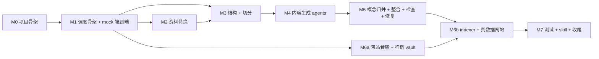

# BookWiki 实现 Plan

> 配 `design.md` 用。Plan 只讲"怎么落地、谁做、什么验收",设计决策不在这里展开。
> 节号引用沿用 `design.md` 的 §X。

---

## 0. 总览

8 个 milestone,关键路径串行,内容 agent 可并行。**M1 一旦上线,其他成员可以同时替换 mock**;在那之前所有人等同一份。

**关键路径**: M0 → M1 → M3 → M4 → M5 → M6b → M7,约 14-18 工作日(单人估算)。
**人力假设**: 按 §21 五人分工,但实际操作中 **A 扛核心(M0/M1/M5/M6b/M7),其他四人能交付到 prompt + 样例数据级别**。Plan 中"责任人"按理想分工标注,带 `*` 的实际可能落到 A。

---

## M0 · 项目骨架(0.5 - 1 天)

**目标**: 仓库可 clone + 装依赖 + `python -m bookwiki --version` 跑得起来。
**责任人**: A。
**依赖**: 无。

### 任务

- [ ] `pyproject.toml`:固定 Python ≥ 3.12,依赖:`langgraph`、`litellm`、`instructor`、`pydantic`、`diskcache`、`tiktoken`、`pyyaml`、`mineru[pipeline,core]`、`pytest`、`pytest-asyncio`、`ruff`
- [ ] 目录骨架按 §19,空文件占位 + `__init__.py`
- [ ] `.env.example` 列出所有 API key 与 `BOOKWIKI_*` 环境变量
- [ ] `pre-commit` + `ruff` 配置
- [ ] `CLAUDE.md`(给 AI 协作者的项目级 instructions,可极简)
- [ ] `tests/fixtures/mini-book/input/` 放 1 份 PDF(10 页内)、1 份 PPTX(5 张内)、1 份 5 题试卷 — 这是后续所有测试的共同基线

### 产物
- 仓库目录、依赖锁文件、empty smoke test pass

### 验收
- `pip install -e .` 成功;`pytest -k smoke` 跑通(空 test)

---

## M1 · 调度骨架 + mock agent 端到端(2 - 3 天)— **解锁所有人**

**目标**: 顶层 LangGraph 图 + 7 个阶段脚本 + run.py + 所有 agent 用 stub 实现,跑通 mini-book 到 SQLite + 启 next.js demo。
**责任人**: A。
**依赖**: M0。
**关键**: 这是阻塞所有其他人的 milestone。完成之前 B/C/D/E 不能并行,完成之后他们各自替换 stub 即可。

### 任务

- [ ] **`bookwiki/scheduler/graph.py`**:
  - LangGraph `StateGraph` 完整 10 个 node(§10.2)
  - `interrupt_before=["split"]` 静态生效
  - `build_graph(cfg, stop_after=None, pause_after=[], dry_run=False)`,内部把 `stop_after` 转 `interrupt_after`
  - `resume_or_start(graph, book_id)` 辅助函数(§17.6)
- [ ] **`bookwiki/scheduler/llm.py`**:
  - `litellm.Router` 配齐 §10.4 的 4 个 model_name,key 从 env 读
  - `instructor.from_litellm(router.acompletion)` 客户端
- [ ] **`bookwiki/scheduler/cache.py`**:
  - `task_key(agent_cls, *inputs, model)` 算 input_hash(§10.6)
  - `run_with_cache(agent_cls, *inputs, model)` 协程
- [ ] **`bookwiki/scheduler/budget_guard.py`**:`raise BudgetExceeded` 当 `router.usage_logs` 超 `budget.maxCostUsd`
- [ ] **`bookwiki/scheduler/dry_run.py`**:`ESTIMATE` 常量表 + `estimate(agent_cls, *inputs)`(§10.8)
- [ ] **`bookwiki/agents/base.py`**:`Agent[I, O]` Protocol(§9.1)
- [ ] **`bookwiki/schemas/*.py`**:全部 Pydantic 模型 + `SCHEMA_VERSION` 常量,见 §9.2
  - `ChapterResult / SummaryResult / QuizResult / CardResult`
  - `ConceptCandidate / ConceptReconciledItem / ConceptResult`
  - `CheckReport / Issue`(必须含 `owner_task_id`)
  - `Citation`(`ref_id`, `quote`,带 validator)
- [ ] **所有 agent 用 stub 实现**:返回硬编码的合法 Pydantic 对象(不调 LLM)。让端到端跑得动
- [ ] **10 个 LangGraph node 函数 stub**:读上游产物路径,写本阶段产物到 work/,return state delta
- [ ] **`scripts/run.py`**:CLI 参数解析 + `build_graph` + `resume_or_start`,接 §17.4 全部开关
- [ ] **`scripts/{convert,structure,split,generate,check,repair,index}.py`**:每个 4 行(§17.1)
- [ ] **`scripts/init_book.py`**:创建 `books/<id>/` 目录树
- [ ] **`scripts/site.py`**:`subprocess.run(["pnpm", "dev"], cwd=site_dir)` 即可
- [ ] **mini-book 用 stub 跑通**:`init_book → convert → structure → split → generate → check → index`,产 `bookwiki.sqlite`,site 能起来

### 产物
- `scripts/*.py` 9 个脚本可执行
- mini-book 端到端 stub 跑通

### 验收
- `python scripts/run.py books/mini` 跑完产出 vault + sqlite
- `python scripts/run.py books/mini --resume` 命中所有 cache,< 1 秒结束
- `python scripts/run.py books/mini --force-from convert` 全部重跑
- `python scripts/structure.py books/mini` 跑完停在 split 前(interrupt_before);手动建 approved-structure.md;`python scripts/split.py books/mini` 直接放行往下跑
- `python scripts/run.py books/mini --dry-run` 输出 Mermaid 图 + 预估 token

---

## M2 · 资料转换(2 天,**与 M3 可并行**)

**目标**: 真的 PDF → sources_md/,PPTX/TXT 也能转。
**责任人**: B(MinerU 部署 + convert/),A 协助接图。
**依赖**: M1 完成(agent 协议固定)。

### 任务

- [ ] **MinerU 服务部署**(B 主导):
  - GPU 机起 `mineru-openai-server --engine vllm --port 30000`
  - 同机或邻机起 `mineru-api --host 0.0.0.0 --port 8000 --enable-vlm-preload true`
  - 文档 `docs/mineru-setup.md` 写部署步骤、依赖版本、健康检查 URL
- [ ] **`bookwiki/convert/mineru_client.py`**:
  - 调 `from mineru.cli.common import do_parse`,`backend="vlm-http-client"`
  - 启动时 `GET /health` 探活,超时/异常 → 切 `backend="pipeline"`,写日志
  - 输出规范化为带 `<!-- source_ref: textbook-pXX -->` 注释的 Markdown
- [ ] **`bookwiki/convert/pptx_to_md.py`**:`python-pptx` 抽文本 + 标题,每 slide 一段,写 `source_ref: lectureN-slideMM`
- [ ] **`bookwiki/convert/text_to_md.py`**:TXT/MD 简单 wrap(每文件一段 source_ref)
- [ ] **`convert_node` 实现**(替换 M1 的 stub):路由文件后缀到对应转换器

### 产物
- `work/sources_md/*.md`,每段有 `source_ref`
- `docs/mineru-setup.md`

### 验收
- mini-book PDF 解析为 markdown,可读、断页清理 ok、每页有 source_ref
- 关掉 mineru-openai-server,重跑 → 日志说切到 pipeline,精度降级但不报错
- 跑出来的 sources_md 能被 M3 的 ChapterSplit 接收

---

## M3 · 结构 + 切分(2 - 3 天)

**目标**: AI 重组大纲 → 人工锁 approved-structure.md → 按主题对齐切 chapter_sources/。
**责任人**: C\*(StructureAgent + ChapterSplit prompt 与 schema)。
**依赖**: M1 完成 + M2 有真的 sources_md 可吃(可以先用 M2 的 fixture)。

### 任务

- [ ] **`bookwiki/agents/source_summary_agent.py`**:每份 sources_md → 摘要 JSON(`models.sourceSummary`,默认 `deepseek-v4-flash`)
- [ ] **`bookwiki/agents/structure_agent.py`**:
  - 输入:所有 source summaries
  - 输出:`proposed-structure.md`(Markdown 大纲,格式见 §7.1)
  - prompt 支持 `pedagogical` / `source` 两种策略
- [ ] **`bookwiki/split/chapter_splitter.py`**:
  - 解析 `approved-structure.md`(Markdown parser,提取章节 id/标题/范围/source_refs 列表)
  - 把 sources_md 的片段按主题归到章节,产 `_alignment.json` 含 confidence
  - 写 `work/logs/chapter-split-report.md`(来源 × 章节矩阵 + 未归属清单)
- [ ] **`bookwiki/agents/chapter_split_agent.py`**:对低置信度片段调 LLM 做归属仲裁(可选,先 rule-only)
- [ ] **`structure_node` / `split_node` 实现**:替换 M1 stub
- [ ] interrupt 测试:`structure.py` 跑完确实停在 split 前,人编辑后 `split.py` 续跑成功

### 产物
- `work/structure/proposed-structure.md`
- `work/structure/approved-structure.md`(人工编辑后)
- `work/chapter_sources/chxx/*.md`
- `work/logs/chapter-split-report.md`

### 验收
- mini-book 跑出至少 2 章合理切分
- 修改 approved-structure.md 后 `split.py` 重跑得到不同 chapter_sources
- 至少 80% 的片段有 source_ref 归属,未归属的进附录桶

---

## M4 · 内容生成 agents(3 - 4 天,**4 个 agent 可并行**)

**目标**: ChapterAgent / SummaryAgent / QuizAgent / CardAgent 真实生成内容。
**责任人**: C\*(chapter/summary),D\*(quiz/card)。
**依赖**: M3 产出真的 chapter_sources/。

### 任务

- [ ] **`bookwiki/agents/chapter_agent.py`**:
  - 输入:chapter_source + (可选)approved-structure.md
  - 输出:`ChapterResult` Pydantic(含 `concepts`, `source_refs`, `body_md`)
  - prompt 使用 `<document>...<chunk ref="...">...</chunk></document>` 包裹(§11.3 注入防御)
  - 走 `models.chapter` = `deepseek-v4-pro`,via `instructor` + `response_model=ChapterResult`
- [ ] **`bookwiki/agents/summary_agent.py`**:`deepseek-v4-flash`
- [ ] **`bookwiki/agents/quiz_agent.py`**:`deepseek-v4-pro`,每章 `quizPerChapter` 道题
- [ ] **`bookwiki/agents/card_agent.py`**:`deepseek-v4-flash`,每章 `cardsPerChapter` 张
- [ ] **cite tool 实现**:
  - `Citation` Pydantic 加 `@field_validator('ref_id')`,在 instructor 调用 context 里塞当前 chunk ref 集合,validator 校验
  - 各 agent 输出 schema 嵌套 `Citation`
- [ ] **`generate_node` 实现**(替换 M1 stub):Send fan-out 每章一子任务,内部 asyncio.gather 4 个 agent
- [ ] **`bookwiki/agents/prompts/`**:每个 prompt 单独文件,带 `PROMPT_VERSION = "v1"` 常量

### 产物
- `work/agent_results/{chXX}.{chapter,summary,quiz,card}.json`(JSON,顶部带 `_schema_version` / `_prompt_version`)

### 验收
- mini-book 每章有 4 份 JSON 都通过 Pydantic
- cite tool 测试:故意让 LLM 编 ref_id → instructor 自动重试纠错(看日志)
- 改一个 prompt 文件里的版本号,`--resume` 时该 agent 全部重跑(input_hash 失效)
- `--dry-run` 估算与实测对比,记录到 cost-model 笔记里手动改 ESTIMATE 常量

---

## M5 · 概念归并 + 整合 + 检查 + 修复(3 - 4 天)

**目标**: 概念页一致、双链对齐、check-report 路由 owner、repair 自愈。
**责任人**: A(integrate / checker / repair 框架),D\*(checker 实际规则),C\*(concept_*)。
**依赖**: M4 产出 agent_results。

### 任务

- [ ] **`bookwiki/agents/concept_extract.py`**:rule-only,从 `ChapterResult.concepts` 直接抽,默认不调 LLM
- [ ] **`bookwiki/agents/concept_reconcile.py`**:
  - 规则去重:归一化 + 别名匹配
  - 一次 LLM 做模糊合并(`models.concept` = `deepseek-v4-pro`)
  - 产 `concepts.reconciled.json` 含 `alias_map`
- [ ] **`bookwiki/agents/concept_agent.py`**:每唯一概念一份 ConceptResult,上下文聚合所有引用章节
- [ ] **`bookwiki/integrator/`**:
  - `chapter_integrator.py`:agent_results JSON → chapter Markdown(BOOKWIKI:BODY/SUMMARY/QUIZ/CARDS 区块)
  - `concept_integrator.py`:concept JSON → concepts/.md
  - `markdown_renderers.normalize_wikilinks(text, alias_map)`:正则替换 `[[别名]]` → `[[规范名]]`
  - `source_ref_validator.py`:cite tool 兜底,白名单外的 ref 报 issue
  - **不调用 LLM**
- [ ] **`integrate_node` 实现**:顶层图独立 node,在 concept_pages 之后,渲染整个 vault/
- [ ] **`bookwiki/checkers/`**:
  - `frontmatter_checker.py`, `quiz_checker.py`, `card_checker.py`, `link_checker.py`, `source_ref_checker.py`, `injection_checker.py`(可疑指令字符串,warning 不阻塞)
  - 每个 issue 必须带 `owner_task_id` + `severity`
- [ ] **`bookwiki/agents/review_agent.py`**:self-refine 输入三元组(原输入 + 上一轮失败输出 + issue),强制 `models.review` = `deepseek-v4-pro`
- [ ] **`repair_node` 实现**:按 `owner_task_id` 分组,fan-out 跑 ReviewAgent,结果回写 agent_results;`maxRepairRounds` 按单元计数
- [ ] **条件边**:`check → repair if repair_targets else index`,`repair → integrate`(重整合受影响章节)

### 产物
- `work/agent_results/concepts.reconciled.json` + `concept.<name>.json`
- `vault/chapters/*.md` + `vault/concepts/*.md`
- `work/logs/check-report.{md,json}`

### 验收
- mini-book 产出至少 5 个概念页,无重复
- 故意改一份 chapter.json 的 quiz 让答案不在 options → check 报 issue,owner_task_id 正确,repair 自动修复后 check 通过
- 故意把"递归"和"递推"在两章用不同名 → reconcile 合并后双链统一指向规范名
- `--pause-after reconcile_concepts` 停下来,手动改 `concepts.reconciled.json` 拆分误合并,resume 后 concept_pages 跑出来反映修改

---

## M6 · SQLite indexer + 网站

### M6a · 网站骨架 + 样例 vault(2 天,**可在 M1 后即开,与 M2-M5 并行**)

**目标**: 用手写样例 vault 验证 Next.js + Fumadocs 渲染、Quiz/Cards 组件、SQLite 搜索接口。
**责任人**: E\*。

- [ ] `site-template/` 全套(app router、Fumadocs 接入、theme)
- [ ] 组件:`WikiLink`、`QuizBlock`、`CardBlock`、`SourceRef`、`SearchBox`、`ChatBox`
- [ ] `lib/sqlite.ts`:better-sqlite3 包装,只读
- [ ] `lib/markdown.ts`:从 vault Markdown 读 frontmatter + 渲染
- [ ] `lib/rag.ts`:`/api/chat` 接 `models.chat`(gemma-4)
- [ ] 手写 2 个样例 chapter.md + 2 个 concept.md 当 fixture
- [ ] 用 fixture 跑 `pnpm dev`,所有功能在浏览器里点一遍

### M6b · indexer + 真数据接通(2 - 3 天)

**目标**: vault → bookwiki.sqlite,网站换接真数据。
**责任人**: E\*,A 协助 schema。
**依赖**: M5 产出 vault/ + M6a 网站骨架。

- [ ] **`bookwiki/indexer/markdown_parser.py`**:解析 vault Markdown 的 frontmatter + 区块
- [ ] **`bookwiki/indexer/rag_chunker.py`**:按 heading 切 chunks,记 source_refs
- [ ] **`bookwiki/indexer/sqlite_builder.py`**:
  - 按 §14 schema 全量建表
  - chunks 用显式 `rowid INTEGER PRIMARY KEY AUTOINCREMENT`
  - 灌完 chunks 跑 `INSERT INTO fts_chunks(fts_chunks) VALUES('rebuild')`
  - 写到 `.tmp` → `os.replace` 原子换
- [ ] **`index_node` 实现**:替换 M1 stub
- [ ] 网站搜索/Quiz/Cards 从 mini-book 真数据走通
- [ ] `/api/chat` 用 gemma-4 真回答 mini-book 问题,显示 source_refs

### 产物
- `site/.bookwiki/bookwiki.sqlite` 真数据
- 可访问的 mini-book demo 站

### 验收
- 浏览器搜"启发函数"能找到对应章节 chunk
- 完成一道 Quiz、看一张 Card 翻转
- 问"什么是 A 星算法?"得到带 source_ref 的回答
- 前端 bundle 不含 OpenAI/Anthropic key(grep 检查)

---

## M7 · 测试 + Skill + 收尾(2 - 3 天)

**目标**: CI 跑 smoke、AI Skill 落地、文档收口。
**责任人**: A。
**依赖**: M6b。

### 任务

- [ ] **`tests/test_schemas.py`**:每个 Pydantic 模型对照 fixture JSON snapshot;改 schema 必须改 fixture
- [ ] **`tests/test_agents.py`**:每个 agent 用 `litellm.completion(..., mock_response=...)` 跑通
- [ ] **`tests/test_scheduler.py`**:LangGraph DAG 拓扑、Send fan-out、`run_with_cache` cache hit/miss、`resume_or_start` 路径分支
- [ ] **`tests/test_integrator.py`**:固定输入 → diff 输出 Markdown
- [ ] **`tests/test_e2e_smoke.py`**:mini-book 全流程,LLM 全 mock,跑通到 SQLite + 启 HTTP server 一秒 smoke
- [ ] **GitHub Actions** (或等价 CI):`pytest -k smoke` 必过才能 merge
- [ ] **`skills/bookwiki/SKILL.md`**:按 §20 写;含触发条件、标准流程、失败时看哪些文件
- [ ] **`skills/bookwiki/references/runbook.md`**:每个阶段脚本怎么跑、`--force-from` 怎么用、interrupt 怎么处理
- [ ] **`skills/bookwiki/references/contracts.md`**:`approved-structure.md` / `*.reconciled.json` / `check-report.json` / `bookwiki.sqlite` schema 摘要
- [ ] **Skill 自验**:让一个没读 design.md 的 AI agent 只加载 skill,完成一次 mini-book 从 `init_book` 到访问网站的流程,根据 check-report 决定 repair / 人工

### 产物
- `tests/` 完整
- `skills/bookwiki/` 完整
- CI 配置

### 验收
- `pytest` 全绿
- AI agent 按 skill 完成 mini-book 跑通

---

## 风险与缓解

| 风险 | 概率 | 缓解 |
|---|---|---|
| MinerU 部署门槛高,B 卡很久 | 高 | M1 完成后即可让 B 开始;不行就退到 `backend="pipeline"` CPU 模式,精度 85+ 可接受 |
| LangGraph + Send + interrupt 行为有坑 | 中 | M1 先跑完 stub 验证 interrupt + resume_or_start;不行退到 `langgraph<0.x` 已验证版本 |
| cite tool validator 让 LLM 频繁重试拖慢 | 中 | M4 验收时观察 instructor 重试次数;超 30% 则换"prompt 强约束 + 整合器兜底校验"路径 |
| gemma-4 / kimi-k2.6 在 litellm 里 provider 字符串变化 | 低 | `scheduler/llm.py` 封装一层,变了改一处 |
| 团队成员真的指望不上 | 高(用户已确认) | A 按 §21 把 critical 标 \*,prompt 调试可让其他成员上,实现兜底 |
| LangSmith 离线归档导出器自己写比想象复杂 | 中 | M7 之前都用 LangSmith UI,manifest 导出延后到 M7;实在不行先不导,只保留 LangSmith |

---

## 验收清单(对照 design.md §26)

| 项目 | 来自 | 实现 milestone |
|---|---|---|
| 输入:1 PDF + 2 PPTX + 1 试卷/笔记 | §26 | M0 fixture |
| sources_md 每份能生成 | §26 | M2 |
| ≥ 5 章节资料包 | §26 | M3 |
| ≥ 5 章节 Markdown | §26 | M5 |
| ≥ 20 概念页无重复 | §26 | M5 |
| 每章 ≥ 5 题 / 8 卡 | §26 | M4 |
| source_refs 真实存在 | §26 | M4 cite + M5 兜底 |
| `--resume` 断点续跑 | §26 | M1 / M5 |
| `run-manifest.json` | §26 | M7(LangSmith 导出) |
| 检查器报 owner | §26 | M5 |
| 定向修复不阻塞 | §26 | M5 |
| SQLite 生成 | §26 | M6b |
| 搜/问答带来源 | §26 | M6b |
| 网站可用 | §26 | M6a + M6b |
| AI Skill 指导一次跑通 | §26 | M7 |
| API key 不入前端 | §26 | M6a 验收 grep |

---

## 时间线汇总

| Milestone | 估时(天) | 累计(天) | 关键路径? |
|---|---|---|---|
| M0 | 0.5 - 1   | 1   | ✓ |
| M1 | 2 - 3     | 4   | ✓ |
| M2 | 2         | 6(并行) |  |
| M3 | 2 - 3     | 7   | ✓ |
| M4 | 3 - 4     | 11  | ✓ |
| M5 | 3 - 4     | 15  | ✓ |
| M6a | 2        | 13(并行) |  |
| M6b | 2 - 3    | 18  | ✓ |
| M7 | 2 - 3     | 21  | ✓ |

**单人关键路径**: ~18 - 21 工作日。
**理想 5 人并行**: ~13 - 15 工作日。
**现实(A 扛大头 + 偶尔协助)**: ~16 - 19 工作日。
